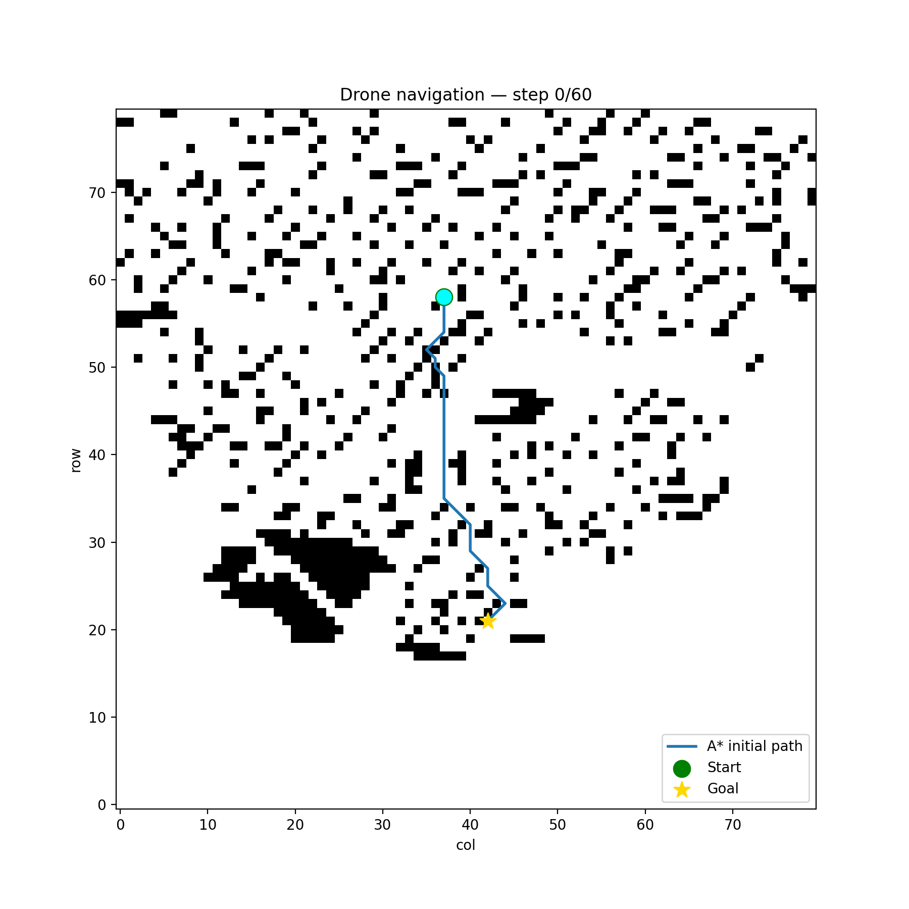

# Drone Obstacle Detection & Path Planning

A Python-based drone navigation simulation that combines custom-trained YOLOv8 obstacle detection with A* initial path planning and D* Lite dynamic replanning. The system simulates a drone flying from point A to point B, detecting obstacles from camera images in real time and rerouting automatically.

---

## How It Works

The simulation runs in two phases:

**1. Initial Planning (A*)**
At takeoff, A* computes the optimal path from start to goal on a city grid built from OpenStreetMap data (or a synthetic grid for simulation).

**2. Flight + Dynamic Replanning (D* Lite)**
As the drone flies, simulated camera frames are fed into a custom-trained YOLOv8 model. If an obstacle is detected, D* Lite incrementally repairs the path — without full replanning — and the drone reroutes around it.

```
Camera Image → YOLOv8 Detection → Obstacle? → D* Lite Replan → Continue Flight
```

---

## Detected Obstacle Classes

Trained on a custom dataset of 5,368 drone-perspective images:

- Trees
- Buildings  
- Powerlines

---

## Project Structure

```
finalProject/
├── src/
│   ├── main.py            # simulation entry point
│   ├── obstacle.py        # YOLO obstacle detection function
│   ├── train.py           # dataset download + model training
│   ├── drone_agent.py     # drone orchestrator (GPS, Kalman, movement)
│   ├── astar.py           # A* initial path planning
│   ├── dstar_lite.py      # D* Lite dynamic replanning
│   ├── kalman.py          # Kalman filter for GPS noise
│   ├── gps_utils.py       # GPS ↔ grid cell conversion
│   └── osm_to_grid.py     # OpenStreetMap → occupancy grid
├── testImages/            # simulated camera frames
├── .env                   # API keys (never pushed to GitHub)
├── .gitignore
└── README.md
```

---

## Setup

### 1. Clone the repo

```bash
git clone <your-repo-url>
cd finalProject
```

### 2. Install dependencies

```bash
pip install ultralytics roboflow python-dotenv opencv-python "numpy<2" matplotlib osmnx
```

### 3. Add your API key

Create a `.env` file in the project root:

```
ROBOFLOW_API_KEY=your_api_key_here
```

Get your key from [app.roboflow.com](https://app.roboflow.com) → Settings → API Keys.

### 4. Download dataset and train the model

Run once to download the dataset and train:

```bash
python3 src/train.py
```

Trained weights will be saved to `runs/detect/train/weights/best.pt`.
Training takes approximately 1-2 hours on CPU.

### 5. Add test images

Place drone-perspective images in `testImages/`. These simulate the front camera feed during flight. Images containing trees, buildings, or powerlines will trigger rerouting.

### 6. Run the simulation

```bash
cd src
python3 drone_agent.py
python3 main.py
```

This will:
- Build an 80x80 city grid
- Plan an initial A* path
- Fly the drone, checking camera images at scheduled steps
- Reroute with D* Lite when obstacles are detected
- Save a `flight_plot.png` showing the planned vs actual path

---

## Usage

```python
from obstacle import detect_obstacle

# returns True if tree/building/powerline detected, False if clear
result = detect_obstacle("testImages/trees1.jpeg")

if result:
    # trigger D* Lite reroute
    pass
else:
    # continue on current path
    pass
```

---

## Simulation Output

```
=== Delivery Drone AI Agent demo ===
Grid built: (80, 80)  blocked cells = 1728
A* initial path: 74 cells from (8, 6) -> (71, 71)
Camera triggers at steps [20, 31, 42, 55]

[CAMERA] Step 20: checking → trees1.jpeg
[OBSTACLE] detected: tree  conf=0.84
  [step  20] D* Lite reroute around (22, 31)

[CAMERA] Step 31: checking → traffic-signals.png
[OBSTACLE] path clear

[CAMERA] Step 42: checking → powerlines1.jpg
[OBSTACLE] detected: powerline  conf=0.71
  [step  42] D* Lite reroute around (48, 44)

Goal reached: True
Total steps : 81
Reroutes    : 2
```

---
## Simulation Demo



---

## Team Contributions

| Component | Owner |
|---|---|
| YOLO model training (`train.py`) | Aisha |
| Obstacle detection function (`obstacle.py`) | Aisha |
| Dataset research + class selection | Aisha |
| A* pathfinding (`astar.py`) | Sowmya |
| D* Lite replanning (`dstar_lite.py`) | Sowmya |
| Drone agent + GPS/Kalman (`drone_agent.py`, `kalman.py`) | Sowmya |
| OpenStreetMap grid (`osm_to_grid.py`) | Sowmya |
| Simulation integration (`main.py`) | Aisha + Sowmya |

---

## Dataset

Training data sourced from [Roboflow Universe — Drone Obstacles Detection](https://universe.roboflow.com/davids-workspace-5pw4j/drone-obstacles-detection).
5,368 images across 3 classes: trees, buildings, and powerlines.

---

## Dependencies

- [Ultralytics YOLOv8](https://github.com/ultralytics/ultralytics)
- [Roboflow](https://roboflow.com)
- OpenCV
- NumPy < 2.0
- Matplotlib
- OSMnx